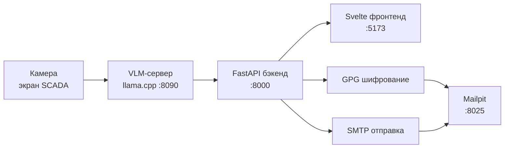
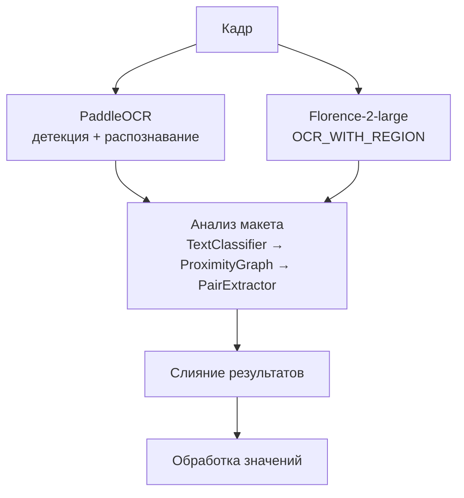
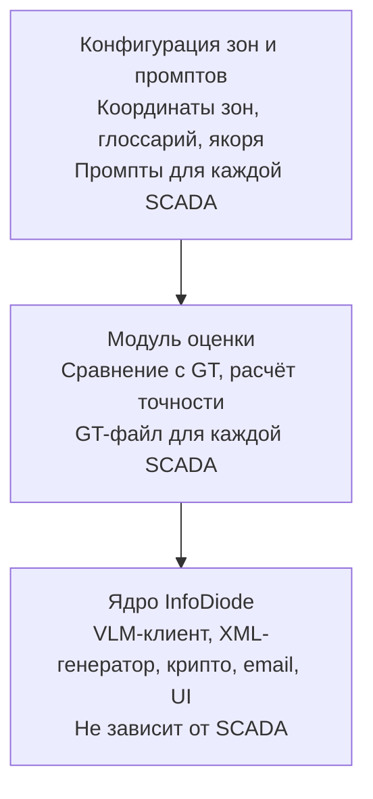

# InfoDiode

**Извлечение данных из изолированных SCADA-систем с помощью визуально-языковых моделей**

InfoDiode — система извлечения данных из воздушно-разграниченных (air-gapped) SCADA-систем, использующая визуально-языковую модель (VLM) для чтения промышленных мнемосхем из видеопотока, упаковки данных в структурированный XML, шифрования GPG и передачи через локальный SMTP — без интеграции с вендором SCADA, без дообучения модели и без доступа к интернету.

> **Валидировано на SCADA ГПА-21 — точность распознавания параметров 97.44%**

---

## Содержание

- [Как это работает](#как-это-работает)
- [Архитектура](#архитектура)
- [Быстрый старт](#быстрый-старт)
- [Оценка и точность](#оценка-и-точность)
- [Неудачный OCR-подход](#неудачный-ocr-подход)
- [Масштабируемость](#масштабируемость)
- [Ограничения и узкие места](#ограничения-и-узкие-места)
- [Пути улучшения](#пути-улучшения)
- [Преимущества перед классическим подходом](#преимущества-перед-классическим-подходом)
- [Технологический стек](#технологический-стек)
- [Структура проекта](#структура-проекта)
- [Подмодули](#подмодули)

---

## Как это работает



**Поток данных:**

```mermaid
graph LR
    V["Видео"] --> EF["Извлечение кадров<br/>интервал 1с"]
    EF --> SZ["Сегментация на зоны<br/>4 зоны SCADA + остаточные области"]
    SZ --> VLM["VLM-анализ<br/>Qwen3.5-4B, промпты по зонам"]
    VLM --> NP["Нормализация параметров<br/>+ валидация диапазонов"]
    NP --> TS["Темпоральное сглаживание<br/>медианный фильтр"]
    TS --> XML["Генерация XML<br/>формат &lt;sheme&gt;, снапшоты 500мс"]
    XML --> GPG["Шифрование GPG"]
    GPG --> SMTP["Отправка email<br/>SMTP"]
```



## Архитектура

### Зонная сегментация — ключевой прорыв

Экран SCADA разбивается на 4 семантические зоны, каждая анализируется отдельным промптом:

| Зона | Содержание | Область SCADA |
|------|-----------|---------------|
| 1 — левая+центр | Компрессор, АВО, атмосферные данные | Основная мнемосхема |
| 2 — правая панель | Давление газа, клапаны, dP | Газовая цепь |
| 3 — нижняя полоса | Уровни масла, температуры, охлаждение, СГУ | Масло/охлаждение |
| 4 — таблица T2 | Таблица температур T2 (8 точек) + подшипники | Мониторинг температур |

**Зонная сегментация — крупнейший прирост точности: 7.84% → 97.44%.**

VLM на 4B параметров не может одновременно обрабатывать 40+ меток на экране 1912×1076. Кадрирование в фокусные зоны позволяет каждому VLM-запросу обрабатывать 5–15 параметров с высокой надёжностью. Координаты зон задаются в относительных величинах (0.0–1.0), что делает их независимыми от разрешения.

### Промпт-инжиниринг

Каждый зонный промпт содержит:
1. **Якорная таблица** — явное соответствие метка → тип → единица → описание
2. **Глоссарий SCADA-аббревиатур** — кириллические сокращения с полными названиями (напр., «Лм» = уровень масла)
3. **Физические ограничения** — типичные диапазоны и десятичная точность по типу параметра
4. **Маппинг на GT-имена** — связи между SCADA-метками и названиями в ground_truth

### Конкурентность и VRAM

- **Максимум 2 параллельных VLM-запроса** (ограничение 8GB VRAM)
- **Batch size = 1** на запрос
- **Пропуск кадров**: SSIM > 0.95 → повторное использование предыдущего результата
- **Ограничение разрешения**: максимум 1600px (интерполяция LANCZOS4)

---

## Быстрый старт

### Требования

| Компонент | Минимум | Рекомендуется |
|-----------|---------|---------------|
| Python | 3.12+ | 3.12.x |
| Node.js | 18+ | 20.x LTS |
| NVIDIA GPU | 8GB VRAM | 12GB+ VRAM |
| RAM | 16GB | 32GB |
| GPG | Установлен в системе | — |

Дополнительно (опционально):
- Docker + NVIDIA Container Toolkit — для контейнеризированного запуска
- Redis — для Celery-задач (не обязателен для локальной разработки)
- Mailpit — для просмотра отправленных email (не обязателен)

### Шаг 1. Подготовка моделей VLM

Модели должны находиться в `backend/models/qwen3.5/`:

```
backend/models/qwen3.5/
├── Qwen3.5-4B-Q4_K_M.gguf   # Основная модель (~2.5GB)
└── mmproj-F32.gguf           # Multimodal projection (~0.8GB)
```

Если модели нет — скачайте скриптом:

```bash
cd scripts
python download_model.py
```

### Шаг 2. Запуск VLM-сервера (инференс)

Откройте отдельный терминал:

```bash
cd llama.cpp

# Windows:
./llama-server.exe -m ../backend/models/qwen3.5/Qwen3.5-4B-Q4_K_M.gguf --mmproj ../backend/models/qwen3.5/mmproj-F32.gguf --port 8090 --n-gpu-layers 99 --ctx-size 8192

# Linux:
./llama-server -m ../backend/models/qwen3.5/Qwen3.5-4B-Q4_K_M.gguf --mmproj ../backend/models/qwen3.5/mmproj-F32.gguf --port 8090 --n-gpu-layers 99 --ctx-size 8192
```

Проверка: откройте http://localhost:8090/health — должен вернуть `{"status": "ok"}`.

> **Важно**: llama-server занимает GPU. Дождитесь полной загрузки модели (~30-60с) перед запуском бэкенда.

### Шаг 3. Запуск бэкенда

Откройте отдельный терминал:

```bash
cd backend

# Установка зависимостей (используется pyproject.toml, не requirements.txt)
pip install -e .

# Если pip install -e . не сработал — установите явно:
pip install fastapi uvicorn[standard] python-multipart opencv-python-headless numpy openpyxl chardet python-gnupg celery[redis] redis qrcode[pil] msgpack pydantic pydantic-settings websockets jinja2 PyJWT bcrypt Pillow httpx huggingface-hub llama-cpp-python

# Запуск в режиме разработки (с auto-reload)
uvicorn app.main:app --reload --port 8000
```

Проверка:
- http://localhost:8000/health — `{"status": "ok", "app": "InfoDiode"}`
- http://localhost:8000/docs — интерактивная Swagger-документация API
- В логах должно быть: `VLM сервер доступен: http://localhost:8090`

### Шаг 4. Запуск фронтенда

Откройте отдельный терминал:

```bash
cd frontend

# Установка зависимостей
npm install

# Запуск в режиме разработки
npm run dev
```

Проверка: откройте http://localhost:5173 — должна отображаться панель управления InfoDiode.

### Шаг 5. Опциональные сервисы

#### Redis (для Celery-задач)

Не обязателен для локальной разработки — pipeline работает через `asyncio.create_task`.

```bash
# Docker:
docker run -d -p 6379:6379 redis:7-alpine
```

#### Mailpit (для просмотра email)

Не обязателен — если не запущен, email просто не отправится, но pipeline продолжит работу.

```bash
# Docker:
docker run -d -p 1025:1025 -p 8025:8025 axllent/mailpit
```

Просмотр email: http://localhost:8025

### Docker (полный стек одной командой)

```bash
# Запуск всех сервисов
docker compose up --build

# Фоновый режим
docker compose up --build -d

# Просмотр логов
docker compose logs -f gpu-pipeline
```

Это запустит 5 сервисов: llama-server, gpu-pipeline (FastAPI), celery-worker, frontend, redis, mailpit.

### Порты

| Сервис | Порт | Назначение | Проверка |
|--------|------|-----------|----------|
| llama-server | 8090 | VLM-инференс (Qwen3.5-4B) | `curl http://localhost:8090/health` |
| FastAPI | 8000 | REST API + WebSocket | http://localhost:8000/docs |
| SvelteKit | 5173 | Панель управления | http://localhost:5173 |
| Redis | 6379 | Брокер сообщений | `redis-cli ping` |
| Mailpit SMTP | 1025 | Локальная отправка email | — |
| Mailpit Web | 8025 | Просмотр email | http://localhost:8025 |

### Тестирование проекта

#### Юнит-тесты (без VLM-сервера)

```bash
cd backend

# Все тесты
pytest tests/ -v

# Конкретный модуль
pytest tests/test_parameter_mapper.py -v
pytest tests/test_xml_generator.py -v
pytest tests/test_qr_engine.py -v

# С покрытием
pytest tests/ --cov=app --cov-report=html
# Откройте htmlcov/index.html для просмотра отчёта
```

#### Ручное тестирование полного цикла

1. **Убедитесь, что llama-server запущен** (шаг 2 выше)
2. **Откройте Swagger UI**: http://localhost:8000/docs
3. **Зарегистрируйтесь**: `POST /api/auth/register` — логин/пароль
4. **Получите токен**: `POST /api/auth/login` — скопируйте `access_token`
5. **Авторизуйтесь**: нажмите 🔓 Authorize в Swagger, введите `Bearer <token>`
6. **Загрузите видео**: `POST /api/video/upload` — выберите .mp4 файл
7. **Запустите обработку**: `POST /api/pipeline/start/{video_id}`
8. **Следите за прогрессом**: `GET /api/pipeline/status/{video_id}` или WebSocket `ws://localhost:8000/ws`
9. **Получите XML**: `GET /api/pipeline/xml/{video_id}`
10. **Зашифруйте**: `POST /api/pipeline/encrypt/{video_id}`
11. **Отправьте email**: `POST /api/pipeline/email/{video_id}` (требуется Mailpit)

#### Тестирование через фронтенд

1. Откройте http://localhost:5173
2. Войдите: admin / admin (создаётся автоматически)
3. Загрузите видео на странице «Video»
4. Перейдите на «Pipeline» → выберите видео → нажмите «Start»
5. Наблюдайте за прогрессом в реальном времени (WebSocket)
6. Результаты появятся на странице «Results»

#### Оценка точности (требуется VLM + ground truth)

```bash
cd backend

# Полная оценка с LLM-судьёй
python run_evaluation.py --vlm --llm-judge \
    --video "../Задание 2/Видео 2/Видео 2.mp4" \
    --ground-truth-xml "../Задание 2/Видео 2/ground_truth.xml"

# Результат: data/reports/Видео 2_llm_judge_evaluation.json
```

---

## Оценка и точность

### Методология

Используется **двухпроходная оценка LLM-as-a-Judge**:

1. **LLM-судья** (Qwen3.5-4B): оценивает каждый распознанный параметр относительно ground truth по совпадению имени и значения. Нативно обрабатывает семантическую эквивалентность кириллических аббревиатур.

2. **Постобработка** (`_upgrade_name_match`): основанная на правилах семантическая эквивалентность для случаев, которые LLM-судья пропустил:
   - ABBREV_MAP: «р» → «давление», «лм» → «уровень масла» и т.д.
   - EQUIV_PAIRS: («т аво», «количество аво»), («рг после кр», «давление после крана») и т.д.
   - Нечёткое сопоставление через SequenceMatcher (порог 0.75)

### Нормализация значений

```python
# "44,5" == "44.5" == "44.500"
def normalize(v):
    v = v.strip().replace(",", ".")
    return f"{float(v):.3f}".rstrip("0").rstrip(".")
```

### Результаты — Видео 2 (ГПА-21)

| Метрика | Формула | Результат |
|---------|---------|-----------|
| **Точность значений** | совпадений / всего × 100% | **97.44%** (38/39) |
| **Точность имён** | имён_совпало / всего × 100% | **100%** (39/39) |
| **Покрытие** | уникальных_совпало / уникальных_ожидается × 100% | **100%** (28/28) |

Единственное несовпадение: «Давление после крана» — ожидалось 44.5, распознано 45.0 (Δ = 0.5, в пределах погрешности визуального считывания).

### Необходимость ручной проверки

Автоматическая оценка — полезный инструмент, но **не заменяет ручную верификацию**. Две ключевые причины:

1. **Ограничения LLM-судьи**. Малая модель (4B), используемая как судья, не всегда корректно понимает семантику SCADA-параметров. Например, «ОП» и «температура подшипника ОП» — один и тот же параметр, но судья может не распознать эквивалентность без явного маппинга. Правила постобработки (`ABBREV_MAP`, `EQUIV_PAIRS`) смягчают проблему, но не покрывают все случаи.

2. **Расхождения в названиях GT**. Имена параметров в ground truth могут отличаться от того, как они обозначены в самой SCADA-системе. Это не ошибка VLM — модель видит и считывает реальную метку с экрана, но GT использует другое название. Примеры из нашего опыта:
   - «Перепад давления на фильтре 1-1» в GT — но в SCADA нет фильтров, это «Давление после крана 2-1»
   - «Количество АВО в работе» в GT = 0, но на экране 44.5 (ошибка составителя GT)
   - Разные формулировки: GT говорит «Температура наружного воздуха», SCADA показывает «Т наруж. возд.»

**Рекомендация**: после автоматической оценки просматривайте `per_timestamp_results` в JSON-отчёте и проверяйте помеченные как несовпадающие параметры. Часть из них окажется правильным распознаванием VLM при ошибке в GT или семантической эквивалентности, не распознанной судьёй.


### Воспроизведение оценки

```bash
# Сначала запустите VLM-сервер (см. Быстрый старт)

# Запуск оценки на любом видео с ground truth
cd backend
python run_evaluation.py --vlm --llm-judge \
    --video "../Задание 2/Видео 2/Видео 2.mp4" \
    --ground-truth-xml "../Задание 2/Видео 2/ground_truth.xml"

# Результаты сохраняются в:
#   data/reports/Видео 2_llm_judge_evaluation.json
```

Для оценки другого видео:
1. Создайте `ground_truth.xml` с ожидаемыми значениями на нужных таймстампах
2. Запустите ту же команду с вашими путями
3. Скрипт извлечёт кадры на таймстампах GT, запустит VLM и сравнит

Полный JSON оценки: [`backend/data/reports/Видео 2_llm_judge_evaluation.json`](backend/data/reports/Видео%202_llm_judge_evaluation.json)

---

## Неудачный OCR-подход

До принятия VLM мы интенсивно тестировали традиционный OCR-конвейер:



### Почему это провалилось

| Метрика | OCR-конвейер | VLM-конвейер |
|---------|-------------|--------------|
| **Точность** | **~15%** | **97.44%** |
| **Задержка на кадр** | **~20 000 мс** | **6 000–18 000 мс** |
| Связывание метка-значение | Ненадёжное | Нативное |
| Распознавание кириллицы | Плохое | Хорошее |
| Требуется дообучение | Да | **Нет** |

**Причины провала:**

1. **Неспособность связать метки со значениями**: OCR извлекает сырой текст с bounding boxes, но не может определить, какая метка относится к какому значению. Алгоритм связывания на основе проксимити не работает на плотных SCADA-экранах.

2. **Ограничения кириллицы**: PaddleOCR плохо читает русские аббревиатуры («Лм», «Рг после кр», «Т АВО») или разбивает их на отдельные токены.

3. **Ограничения Florence-2**: Вариант `large-ft` падает на изображениях > 768px (лимит positional embeddings). Вариант `large` работает, но не может связывать метки со значениями. Инференс: ~8–12с на GPU.

4. **Отсутствие семантического понимания**: OCR обрабатывает весь текст одинаково — метки параметров, единицы, статусные индикаторы, пункты меню. VLM естественным образом понимает, какие элементы являются параметрами и что означают их метки.

**Главный вывод**: OCR — неправильная абстракция для извлечения данных из SCADA. Проблема не в *распознавании текста*, а в *семантическом понимании структурированных визуальных макетов*. VLM решает обе задачи без дообучения.

---

## Масштабируемость

### Протестировано на

**ГПА-21** — газоперекачивающий агрегат, но архитектура спроектирована для расширяемости.

### Адаптация к новой SCADA-системе

| Шаг | Что делать | Трудозатраты | Изменения кода |
|-----|-----------|-------------|----------------|
| 1. Калибровка зон | Задать новые прямоугольники зон в `zone_segmentor.py` | ~1ч | 1 файл |
| 2. Промпт-инжиниринг | Написать зонные промпты в `prompts.py` | ~2ч на зону | 1 файл |
| 3. Ground truth | Создать GT XML для валидации | ~1–2ч | Нет |
| 4. VLM-клиент | Без изменений | — | Нет |
| 5. Генератор XML | Без изменений (формат фиксирован) | — | Нет |
| 6. Крипто/email | Без изменений (не зависит от SCADA) | — | Нет |
| 7. Фронтенд | Без изменений (отображает любые VLM-результаты) | — | Нет |

**Предметные знания о SCADA живут в промптах, а не в коде.** Переход на другую систему требует изменения промптов и координат зон, а не рефакторинга кода.

### Принцип проектирования



---

## Ограничения и узкие места

### Задержка инференса

| Метрика | Значение | Причина |
|---------|----------|---------|
| VLM на кадр | **6 000–18 000 мс** | 4 зонных запроса × 3–5с каждый |
| Полное видео (365с, 1к/с) | ~10–30 мин | Последовательная обработка + лимит VRAM |
| Память GPU | 8GB VRAM | Ограничивает batch size и конкурентность |

### Галлюцинации VLM

Малые VLM (4B) иногда производят:
- **Дрейф значений**: 44.5 → 45.0 (округление при визуальном считывании)
- **Фантомные параметры**: Несуществующие метки в разреженных зонах
- **Пустые значения**: Видимые, но не извлечённые (смягчается якорными таблицами в промптах)

### Чувствительность координат зон

Координаты зон откалиброваны для ГПА-21 при 1912×1144. Другие разрешения или макеты SCADA требуют перекалибровки.

### Реалтайм-обработка

Архитектура InfoDiode **поддерживает реалтайм-обработку** — ограничением является только вычислительная инфраструктура, а не программная архитектура.

На текущем оборудовании (1× NVIDIA GPU, 8GB VRAM) задержка составляет 6–18 секунд на кадр, что ограничивает систему режимом **периодического извлечения снапшотов** (интервал 500мс с последующей оффлайн-обработкой).

Для реалтайма (≤1с на кадр) достаточно масштабировать инфраструктуру:

| Конфигурация | Ожидаемая задержка/кадр | Подход |
|-------------|----------------------|--------|
| 1× NVIDIA GPU, 8GB (текущая) | 6–18с | Периодические снапшоты |
| 1× NVIDIA A100, 40GB | ~2–4с | Квазиреалтайм (batch + крупная модель) |
| 2× NVIDIA A100, 80GB | ~0.5–1с | **Реалтайм** (параллельный инференс зон) |
| 4× NVIDIA H100, 80GB | ~0.2–0.5с | Реалтайм + резерв для других задач |

Программные оптимизации для реалтайма (без изменения архитектуры):
- **Параллельный инференс зон**: 4 GPU обрабатывают 4 зоны одновременно → задержка определяется самой медленной зоной (~3с)
- **Speculative decoding**: Быстрая черновая модель + верификация основной моделью → 2× ускорение
- **Continuous batching** (vLLM): Объединение запросов от разных кадров в один батч → утилизация GPU ~90%
- **Prompt caching**: Кеширование системных промптов между запросами → экономия ~30% токенов

---

## Пути улучшения

### Краткосрочные (на текущем оборудовании)

| Улучшение | Эффект | Трудозатраты |
|-----------|--------|-------------|
| Динамическая детекция зон | Автоопределение границ зон | 2 недели |
| Кеширование промптов | Снижение стоимости токенов | 1 неделя |
| Консенсус по множеству кадров | Голосование по 3+ кадрам | 3 дня |
| Повтор по confidence | Повторный анализ низкоуверенных зон | 2 дня |

### Среднесрочные (лучшее оборудование)

| Улучшение | Эффект | Требование |
|-----------|--------|-----------|
| Крупная VLM (7B/14B) | Выше точность, меньше галлюцинаций | 16–24GB VRAM |
| GPU-батчинг | Ускорение в 3–4× | 24GB+ VRAM |
| Спекулятивный декодинг | Ускорение в 2× | Multi-GPU или быстрый CPU |

### Долгосрочные (изменение архитектуры)

| Улучшение | Подход |
|-----------|--------|
| Перенос на новые SCADA | Few-shot промптинг с 2–3 примерами кадров |
| Стриминг-анализ | Буфер кадров + скользящее окно |
| Краевой деплоймент | Квантованная INT4 модель + TensorRT на Jetson |
| Активное обучение | Человек-в-контуре для сомнительных показаний |

---

## Преимущества перед классическим подходом

### Не требуется дообучение

| Подход | Данные для обучения | Время настройки | Точность |
|--------|-------------------|----------------|----------|
| Кастомный OCR + правила | 500+ кадров | 2–4 недели | ~15% |
| Дообученная Florence-2 | 1000+ кадров | 1–2 недели | ~40–60% (оценка) |
| **InfoDiode (VLM + промпты)** | **0 кадров** | **2–4 часа** | **97.44%** |

### Мультиязычность по умолчанию

Qwen3.5-4B нативно обрабатывает кириллицу, латиницу и смешанные скрипты. Не нужна специальная языковая конфигурация или обучение шрифтам.

### Понимание макета

VLM понимает:
- **Пространственные связи**: «Это число относится к этой метке»
- **Структурный контекст**: «Это строка таблицы, а не случайное число»
- **Семантическую интерпретацию**: «Этот красный индикатор — авария, а не значение параметра»

### Плавная деградация

- Пустые значения вместо галлюцинированных чисел
- Оценки confidence для каждого параметра
- Флаги выхода за диапазон при нарушении физических ограничений

### Быстрая итерация

- Новый параметр? Добавьте строку в якорную таблицу промпта
- Неверная аббревиатура? Обновите глоссарий
- Другая SCADA? Напишите новые зонные промпты (без переобучения)

---

## Технологический стек

| Компонент | Технология | Версия |
|-----------|-----------|--------|
| Бэкенд | FastAPI + asyncio | Python 3.12+ |
| VLM | Qwen3.5-4B-GGUF (Q4_K_M) | через llama.cpp |
| Инференс | llama-server (OpenAI-совместимый API) | Кастомная сборка |
| Фронтенд | SvelteKit 5 + Tailwind CSS v4 | Node.js |
| Шифрование | GPG (python-gnupg) | OpenPGP |
| Email | Локальный SMTP (Mailpit) | Разработка |
| Брокер сообщений | Redis + Celery | Продакшен |
| Контейнеризация | Docker Compose | Offline-first |
| Тестирование | pytest | 39/39 проходят |

---

## Структура проекта

```
hack/
├── README.md                          ← Вы здесь
├── backend/
│   ├── README.md                      ← Детали бэкенда
│   ├── app/
│   │   ├── main.py                    # Точка входа FastAPI, проверка здоровья VLM
│   │   ├── config.py                  # Настройки (VLM, SMTP, GPG, JWT)
│   │   ├── api/routes/                # auth, video, pipeline, evaluation
│   │   ├── api/websocket.py           # Обновления прогресса в реальном времени
│   │   ├── core/
│   │   │   ├── vlm_pipeline.py        # Основной оркестратор VLM-конвейера
│   │   │   ├── vlm_client.py          # Асинхронный VLM-клиент (OpenAI API)
│   │   │   ├── zone_segmentor.py      # Кадр → 4 зоны + остаточные области
│   │   │   ├── prompts.py             # Зонные промпты
│   │   │   ├── video_ingestion.py     # Извлечение кадров из видео
│   │   │   ├── xml_generator.py       # Генерация XML <sheme>
│   │   │   ├── crypto_service.py      # Шифрование GPG
│   │   │   ├── email_service.py       # Отправка email через SMTP
│   │   │   ├── qr_engine.py          # QR v40 + msgpack+zlib
│   │   │   └── qr_overlay.py         # Наложение QR на видео
│   │   ├── models/                    # Pydantic v2 схемы
│   │   ├── evaluation/                # Сбор метрик
│   │   ├── utils/                     # Утилиты для изображений, текста, XML
│   │   └── deprecated/                # Устаревший OCR-конвейер
│   ├── run_evaluation.py              # Автономный скрипт оценки
│   └── tests/                         # Набор pytest (39 тестов)
├── frontend/
│   ├── README.md                      ← Детали фронтенда
│   └── src/
│       ├── routes/                    # Dashboard, Pipeline, Results, QR, Eval
│       ├── lib/components/            # UI-компоненты
│       └── lib/stores/                # Svelte 5 runes (pipeline, metrics)
├── llama.cpp/                         # Бинарники llama-server + DLL
├── data/                              # input_videos, output_xml, qr_codes, GPG-ключи
├── scripts/                           # setup_gpg, start_llama_server
└── docker-compose.yml                 # Оркестрация полного стека
```

## Подмодули

- **[backend/README.md](backend/README.md)** — API бэкенда, VLM-конвейер, оценка, конфигурация
- **[frontend/README.md](frontend/README.md)** — Панель управления, компоненты, архитектура Svelte 5

---

## Лицензия

Внутренний проект — РТУ МИРЭА, 2026.
