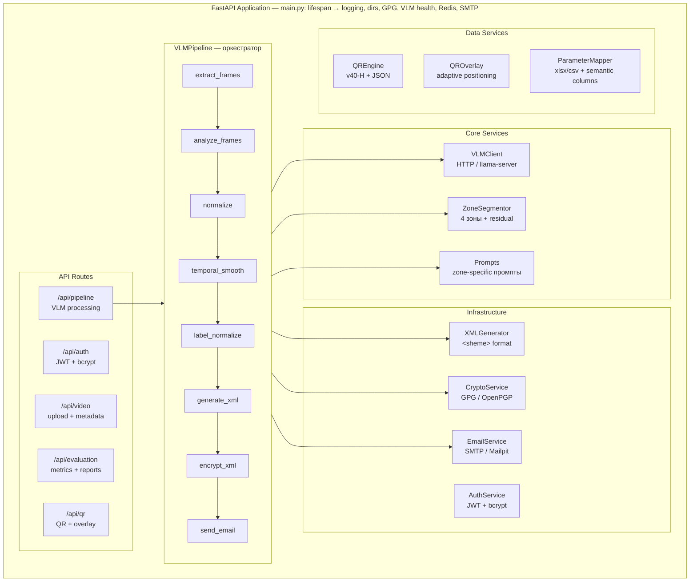
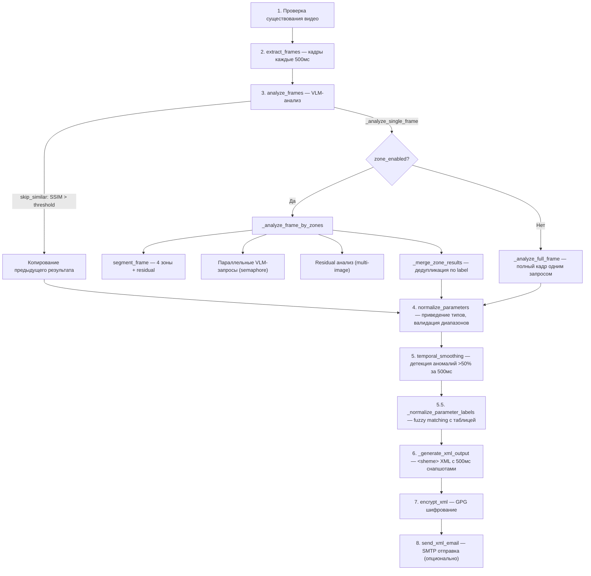
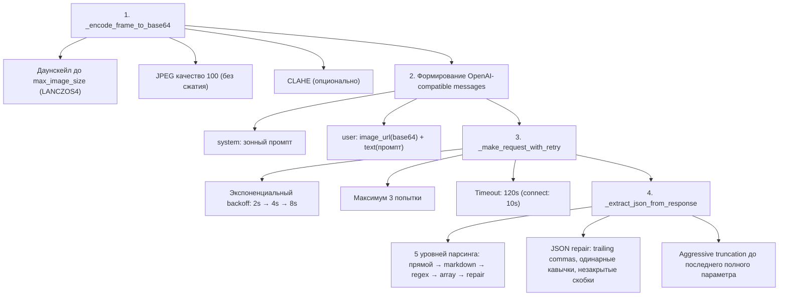

# InfoDiode — Бэкенд

FastAPI-бэкенд для извлечения параметров SCADA через VLM (Qwen3.5-4B). Обрабатывает видео, оркестрирует VLM-инференс, генерирует XML, шифрует GPG и отправляет email.

---

## Содержание

- [Архитектура](#архитектура)
- [Жизненный цикл приложения](#жизненный-цикл-приложения)
- [API-эндпоинты](#api-эндпоинты)
- [Модули ядра](#модули-ядра)
  - [VLM Pipeline](#vlm-pipeline-appcorevml_pipelinepy)
  - [VLM Client](#vlm-client-appcorevlm_clientpy)
  - [Промпты](#промпты-appcorepromptspy)
  - [Сегментатор зон](#сегментатор-зон-appcorezone_segmentorpy)
  - [Генератор XML](#генератор-xml-appcorexml_generatorpy)
  - [Параметры таблиц](#параметры-таблиц-appcoreparameter_mapperpy)
  - [Крипто-сервис](#крипто-сервис-appcorecrypto_servicepy)
  - [Email-сервис](#email-сервис-appcoreemail_servicepy)
  - [Аутентификация](#аутентификация-appcoreauth_servicepy)
  - [QR-движок](#qr-движок-appcoreqr_enginepy)
  - [QR-оверлей](#qr-оверлей-appcoreqr_overlaypy)
  - [Загрузка видео](#загрузка-видео-appcorevideo_ingestionpy)
- [Модели данных](#модели-данных)
- [WebSocket](#websocket)
- [Скрипт оценки](#скрипт-оценки-run_evaluationpy)
- [Конфигурация](#конфигурация)
- [Тестирование](#тестирование)
- [Устаревшие модули](#устаревшие-модули)

---

## Архитектура



---

## Жизненный цикл приложения

Запуск через `asynccontextmanager` в [main.py](app/main.py):

1. **Логирование** — уровень DEBUG/INFO, подавление httpx/PIL/urllib3
2. **Баннер** — режим (локальный/Docker), URL API, WebSocket
3. **Директории** — создание `data/input_videos`, `output_xml`, `qr_codes`, `encryption_keys`, `models`, `calibration`
4. **GPG-ключ** — генерация RSA-4096 если не существует (batch mode, без пароля)
5. **VLM health** — `GET /health` на llama-server (не блокирует запуск)
6. **Redis** — `PING` (не блокирует, Celery опциональна)
7. **SMTP** — `NOOP` на Mailpit (не блокирует)
8. **Admin** — создание пользователя `admin/admin` если БД пуста

---

## API-эндпоинты

### Конвейер обработки (`/api/pipeline`)

| Метод | Эндпоинт | Описание | Реализация |
|-------|----------|----------|-----------|
| POST | `/start/{video_id}` | Запуск VLM-обработки | Создаёт `VLMPipeline`, запускает `process_video()` в фоне через `asyncio.create_task`, рассылает прогресс через WebSocket |
| GET | `/status/{video_id}` | Статус конвейера | Возвращает `PipelineStatusResponse` из in-memory кеша `_pipeline_states` |
| GET | `/frames/{video_id}` | Список кадров | Формирует список `FrameInfo` с timestamps |
| GET | `/xml/{video_id}` | Получить XML | Читает файл из `output_xml/`, возвращает `XmlResponse` |
| POST | `/encrypt/{video_id}` | Шифрование GPG | Вызывает `encrypt_xml()`, сохраняет `.xml.gpg` |
| POST | `/email/{video_id}` | Отправка SMTP | Вызывает `send_xml_email()` с GPG-вложением |
| POST | `/table/{video_id}` | Загрузка таблицы | Принимает `.xlsx`/`.csv`, парсит через `ParameterMapper`, сохраняет в память для текущего pipeline |
| GET | `/vlm-health` | Проверка VLM | Вызывает `vlm_client.health_check()`, возвращает статус |

### Видео (`/api/video`)

| Метод | Эндпоинт | Описание | Реализация |
|-------|----------|----------|-----------|
| POST | `/upload` | Загрузка видеофайла | Сохраняет в `input_videos/`, определяет тип (direct/handheld) через анализ тёмных границ, возвращает метаданные |
| GET | `/list` | Список видео | Сканирует `input_videos/`, возвращает метаданные каждого файла |
| GET | `/{video_id}` | Информация о видео | Поиск по ID, возвращает `VideoUploadResponse` |

### Аутентификация (`/api/auth`)

| Метод | Эндпоинт | Описание | Реализация |
|-------|----------|----------|-----------|
| POST | `/login` | Вход (JWT) | `authenticate_user()` + `create_access_token()`, возвращает Bearer token |
| POST | `/register` | Регистрация | `register_user()` с bcrypt хешированием, хранение в `data/users.json` |
| GET | `/profile` | Профиль | `get_current_user()` через JWT decode |
| PUT | `/profile` | Обновление профиля | `update_user_profile()` |
| PUT | `/password` | Смена пароля | `change_password()` с верификацией старого |
| PUT | `/email-settings` | Настройки email | `update_email_settings()` — список получателей XML |

### Оценка (`/api/evaluation`)

| Метод | Эндпоинт | Описание | Реализация |
|-------|----------|----------|-----------|
| GET | `/accuracy` | Метрики точности | Читает последний JSON-отчёт из `data/reports/` |
| GET | `/latency` | Метрики задержки | Агрегирует latency из pipeline states |
| POST | `/report/{video_id}` | Генерация отчёта | Запускает оценку через `run_evaluation.py` |

### QR (`/api/qr`)

| Метод | Эндпоинт | Описание | Реализация |
|-------|----------|----------|------------|
| POST | `/generate/{video_id}` | Генерация overlay-видео | Кодирует каждый снапшот XML в QR v40-H (177×177 px), размещает адаптивно в области с минимальным контентом, накладывает на видео |
| GET | `/video/{video_id}` | Скачивание overlay-видео | FileResponse MP4 |
| GET | `/status/{video_id}` | Статус QR/overlay | Проверяет наличие overlay-видео, исходных XML/видео, возвращает формат QR (v40-H, JSON) |
| POST | `/decode` | Декодирование QR (верификация) | Принимает `qr_data` (raw JSON или `INFODIODE:<base64>`), возвращает декодированные параметры |

### WebSocket

| Эндпоинт | Описание |
|----------|----------|
| `ws://localhost:8000/ws` | Real-time обновления прогресса конвейера |

Типы сообщений:
- `progress` — процент выполнения, текущий шаг, обработано/всего кадров
- `ocr_result` — результат распознавания параметра (id, label, value, confidence, source)

---

## Модули ядра

### VLM Pipeline (`app/core/vlm_pipeline.py`)

Главный оркестратор обработки видео. Класс `VLMPipeline` реализует полный цикл:

#### `process_video()` — Основной метод



#### `extract_frames()` — Извлечение кадров

- Интервал: 500мс (configurable через `vlm_frame_interval_ms`)
- Timestamps: `.001`, `.501`, `1.001`, `1.501`, ...
- Позиционирование: `cv2.CAP_PROP_POS_MSEC` для точного seek
- CLAHE: опционально, LAB color space + L-channel enhancement (clipLimit=2.0, tileGridSize=8×8)
- Возвращает: `list[tuple[np.ndarray, str]]` — (BGR frame, "HH:MM:SS.mmm")

#### `analyze_frames()` — Параллельный анализ

- `asyncio.Semaphore(concurrency)` — ограничение параллельных VLM-запросов
- `asyncio.Lock` — thread-safe обновление прогресса
- `asyncio.gather()` — параллельный запуск всех кадров
- Результаты сохраняют оригинальный порядок через индексы

#### `_compute_frame_similarity()` — Пропуск похожих кадров

- NCC (Normalized Cross-Correlation) через `cv2.matchTemplate(TM_CCOEFF_NORMED)`
- Нормализация [-1, 1] → [0, 1]
- Если similarity >= threshold → копируется результат предыдущего кадра

#### `normalize_parameters()` — Нормализация

- Fallback `name` → `label` (VLM иногда возвращает `name` вместо `label`)
- `_normalize_value()`: запятая → точка, удаление единиц из значения
- Валидация диапазона через `validate_value_in_range()` (использует `PARAMETER_TYPE_TABLE`)
- `confidence` clamp [0.0, 1.0]

#### `temporal_smoothing()` — Временное сглаживание

- Сравнение значений между соседними кадрами по label
- Аномалия: изменение >50% за один интервал 500мс
- Помечает `anomaly=True` и `change_pct`
- Не исправляет значения — только помечает для анализа

#### `_normalize_parameter_labels()` — Нормализация лейблов

- Fuzzy matching: `SequenceMatcher` (порог 0.80)
- Удаление тегов типа `(PT4413)` перед сравнением
- Если совпадение ≥80% → заменяет VLM-лейбл на имя из таблицы
- Если <80% → помечает `skip=True` (не попадёт в XML)
- Назначает стабильные `param_id` из таблицы

#### `_generate_xml_output()` — Генерация XML

- ID параметров из таблицы (стабильные across кадров)
- Fallback: динамический счётчик для параметров не из таблицы
- 500мс интерполяция: если `frame_interval_ms >= 1000`, создаёт промежуточный снапшот на +500мс
- Pydantic-валидация `VLMResponse` перед генерацией

---

### VLM Client (`app/core/vlm_client.py`)

Асинхронный OpenAI-совместимый клиент для llama-server.

#### Два режима работы

1. **HTTP-клиент** (`VLMClient`) — через `httpx.AsyncClient` к `localhost:8090/v1/chat/completions`
2. **Native-клиент** (`VLMClientDirect`) — через `llama-cpp-python` (без HTTP overhead)

Выбор: `get_vlm_client()` пытается сначала `VLMClientDirect`, fallback на HTTP.

#### `analyze_frame()` — Анализ одного кадра



#### `analyze_multi_image()` — Multi-image запрос

- Используется для residual областей
- Несколько изображений в одном `user` message
- Тот же JSON extraction pipeline

#### JSON Repair Pipeline

5 уровней извлечения JSON:

| Попытка | Метод | Описание |
|---------|-------|----------|
| 1 | `json.loads` | Прямой парсинг |
| 2 | Markdown code block | `\`\`\`json\n{...}\n\`\`\`` |
| 3 | Regex brace extraction | `\{.*\}` с repair |
| 4 | Regex array extraction | `\[.*\]` → `{"parameters": [...]}` |
| 5 | Fallback parse | Последняя попытка с repair |

Repair `_repair_json()` исправляет:
- Комментарии `//` и `/* */`
- Одинарные кавычки → двойные
- Missing commas между объектами/полями
- Trailing commas перед `}` или `]`
- Незакрытые строки и скобки
- Aggressive truncation до последнего полного параметра

---

### Промпты (`app/core/prompts.py`)

Модуль промпт-инжиниринга (~1050 строк). Ключевой компонент, определяющий точность VLM.

#### Структуры данных

- **`ParameterType`** — Enum типов SCADA-параметров (T, P, dP, Vb, L, n, Pos, V, f, R)
- **`PARAMETER_TYPE_TABLE`** — физические диапазоны, единицы, десятичные знаки по типу
- **`ZONE_SYSTEM_PROMPTS`** — 4 зонных системных промпта
- **`RESIDUAL_SYSTEM_PROMPT`** — промпт для остаточных областей

#### Зонные промпты

| Зона | Содержимое промпта |
|------|-------------------|
| 1 (left_center) | Компрессор, АВО, атмосферное давление, температура наружного воздуха. Якорная таблица: ~15 параметров с метками и диапазонами |
| 2 (right_panel) | Газовая цепь, клапаны, дифференциальное давление. Якорная таблица: ~12 параметров |
| 3 (bottom_strip) | Масло ГТД/ЦБК, охлаждение, СГУ, температура подогрева газа. Якорная таблица: ~10 параметров |
| 4 (t2_bearings) | Таблица температур T2 (8 точек), подшипники ОП/ОУП/РК/УК. Якорная таблица: ~15 параметров |

#### Компоненты каждого промпта

1. **Якорная таблица** — явное соответствие: метка на экране → тип → единица → описание. VLM видит ожидаемые параметры и не галлюцинирует
2. **Глоссарий SCADA-аббревиатур** — «Лм» = уровень масла, «ОП» = опорный подшипник, «Рг» = давление газа и т.д.
3. **Физические ограничения** — типичные диапазоны и десятичная точность по типу параметра
4. **Маппинг на GT-имена** — связи между SCADA-метками и названиями в ground_truth
5. **JSON output schema** — точная структура ожидаемого ответа

#### `build_zone_messages()` — Формирование промптов для зоны

- Выбирает `ZONE_SYSTEM_PROMPTS[zone_id]`
- Добавляет timestamp и зону в user prompt
- Возвращает `(system_prompt, user_prompt)`

#### `build_residual_messages()` — Промпт для остаточных областей

- Другой системный промпт (поиск упущенных параметров)
- Multi-image: несколько кропов в одном запросе

#### `validate_value_in_range()` — Валидация диапазона

- Проверяет числовое значение по `PARAMETER_TYPE_TABLE`
- Возвращает `(is_valid: bool, range_info: dict)`

---

### Сегментатор зон (`app/core/zone_segmentor.py`)

Разбивает кадр SCADA на 4 зоны + остаточные области.

#### Зоны (относительные координаты)

| Зона | Имя | x1_rel | y1_rel | x2_rel | y2_rel | Содержимое |
|------|-----|--------|--------|--------|--------|-----------|
| 1 | left_center | 0.109 | 0.059 | 0.397 | 0.828 | КЦ, АВО, давление |
| 2 | right_panel | 0.388 | 0.059 | 0.758 | 0.818 | Газ, клапаны, dP |
| 3 | bottom_strip | 0.010 | 0.819 | 0.759 | 0.986 | Масло ГТД/ЦБК |
| 4 | t2_bearings | 0.759 | 0.002 | 1.000 | 0.736 | Таблица T2, подшипники |

#### `segment_frame()` — Основной метод

1. Вычисляет абсолютные координаты из относительных (`x = x_rel * frame_width`)
2. Кропает каждую зону с padding (по умолчанию 15px)
3. Upscale кропов < `min_crop_size` (512px) через `cv2.INTER_LANCZOS4`
4. Вычисляет остаточные области (части кадра, не покрытые зонами)
5. Возвращает `(zone_crops: list[ZoneCrop], residual_crops: list[np.ndarray])`

#### `ZoneDef` — Определение зоны

Dataclass с относительными координатами, цветом для визуализации, описанием. Координаты калиброваны по базовому разрешению 2431×1366.

#### `ZoneCrop` — Результат кропа

Dataclass с абсолютными координатами, изображением зоны и метаданными.

---

### Генератор XML (`app/core/xml_generator.py`)

Генерирует XML в формате `<sheme>` согласно спецификации.

#### `generate_xml()` — Генерация

Ручная генерация строк (не xml.etree) для точного формата:
```xml
<sheme id="video_id">
<parameters timestamp = "00:00:05.000">
    <param id="1" name="Т газа" desc="Температура газа" unit="°C">0.3</param>
    <param id="2">44.5</param>
</parameters>
</sheme>
```

Особенности:
- `<sheme>` (не `<scheme>`) — согласно спецификации
- Пробелы вокруг `=` в атрибутах: `timestamp = "..."`
- ID параметров отсортированы по возрастанию
- XML-экранирование спецсимволов через `xml.sax.saxutils.escape`
- Опциональные атрибуты `name`, `desc`, `unit` если есть метаданные

#### `validate_xml_format()` — Валидация

Проверяет:
- Корневой элемент `<sheme>`
- Атрибут `id` в `<sheme>`
- Формат `timestamp = "HH:MM:SS.mmm"` (с пробелами)
- Наличие `<param id="...">`
- Закрывающий `</sheme>`

#### `create_snapshot()` — Создание снимка

- Конвертирует timestamp (float/int мс → строка HH:MM:SS.mmm)
- Упаковывает параметры и метаданные в `SnapshotData`

---

### Параметры таблиц (`app/core/parameter_mapper.py`)

Загрузчик и парсер таблиц параметров из Excel/CSV.

#### `load_parameter_table()` — Загрузка

Поддерживает два формата:
1. **Excel .xlsx** (основной, UTF-8) — обходит все листы, адаптивное определение колонок
2. **CSV** (fallback, Windows-1251 с auto-detect через chardet)

#### Семантическое определение колонок

Не использует захардкоженные индексы. Определяет роль колонки по ключевым словам в заголовках:

| Роль | Ключевые слова |
|------|---------------|
| name | наименование, описание, параметр, name |
| unit | единиц, измерен, ед., unit |
| short_name | коротк, сокращ, код, тег, tag |
| decimal_places | знак, точн, разряд, decimal |
| type | тип, величина, type |
| id | №, номер, id, n |

#### Выходной формат

Список словарей с полями: `id`, `name`, `unit`, `short_name`, `decimal_places`, `sheet_name`.

Таблица используется для:
- Назначения стабильных ID параметрам в XML
- Fuzzy matching лейблов VLM → имена из таблицы
- Фильтрации галлюцинаций (параметры не из таблицы помечаются `skip=True`)

---

### Крипто-сервис (`app/core/crypto_service.py`)

Шифрование через GPG (OpenPGP) с использованием `python-gnupg`.

#### `encrypt_xml()` — Шифрование

1. UTF-8 кодировка XML (кириллица корректно обрабатывается)
2. `gpg.encrypt(xml_bytes, recipients=[gpg_recipient], always_trust=True)`
3. Возвращает ASCII-armored байты (совместимо с email)
4. Опциональное сохранение в файл

#### `decrypt_xml()` — Расшифровка

1. `gpg.decrypt(encrypted_bytes)`
2. UTF-8 декодирование результата

GPG-ключ генерируется при старте приложения: RSA-4096, batch mode, без пароля. Хранится в `data/encryption_keys/`.

---

### Email-сервис (`app/core/email_service.py`)

Отправка зашифрованных XML через SMTP.

#### `send_xml_email()` — Отправка

1. Формирование `MIMEMultipart` письма
2. Текст письма: «InfoDiode: зашифрованные данные SCADA мнемосхемы»
3. Вложение: `MIMEBase("application", "pgp-encrypted")` с base64 кодированием
4. SMTP отправка: `smtplib.SMTP(host, port)`

Конфигурация:
- Локально: `localhost:1025` (Mailpit)
- Docker: `mailpit:1025`
- Отправитель и получатель: `smtp_from` (отправляем себе)

---

### Аутентификация (`app/core/auth_service.py`)

JWT-аутентификация с хранением пользователей в JSON-файле (офлайн-first).

#### Хранение

`data/users.json` — flat JSON с username как ключ. Формат записи:
```json
{
  "admin": {
    "username": "admin",
    "email": "admin@infodiode.local",
    "full_name": "Администратор",
    "hashed_password": "$2b$12$...",
    "email_recipients": ["admin@infodiode.local"],
    "default_recipient": "admin@infodiode.local",
    "theme": "dark",
    "created_at": 1234567890.123
  }
}
```

#### Компоненты

| Функция | Описание |
|---------|----------|
| `hash_password()` | bcrypt с auto-generated salt |
| `verify_password()` | bcrypt check |
| `create_access_token()` | JWT encode с exp (default 24h) |
| `decode_access_token()` | JWT decode + валидация |
| `register_user()` | Создание пользователя (уникальный username) |
| `authenticate_user()` | Проверка username + password |
| `create_default_admin()` | Создание admin/admin при пустой БД |
| `change_password()` | Смена пароля с верификацией старого |
| `update_email_settings()` | Настройка получателей XML |

#### API-защита

`get_current_user()` в `auth.py` — Dependency injection:
1. Извлекает Bearer token из `Authorization` header
2. Декодирует JWT через `decode_access_token()`
3. Загружает пользователя из JSON
4. Возвращает данные или HTTP 401

---

### QR-движок (`app/core/qr_engine.py`)

Генератор QR-кодов v40-H (177×177 модулей = 177×177 px) по требованиям задания.

#### Параметры QR (по отчёту qr_code.txt)

| Параметр | Значение | Обоснование (отчёт) |
|----------|----------|---------------------|
| Version | 40 | Фиксированный 177×177 модулей  |
| box_size | 1 | 1 модуль = 1 пиксель → точный размер 177×177 px  |
| border | 0 | Quiet zone обеспечивается при наложении  |
| Error correction | H (30%) | Для камеры с углами, бликами, размытием  |
| fill_color | `#0a2540` | Стильный тёмно-синий + высокий контраст  |
| back_color | `#ffffff` | Белый фон (best practice #4) |

#### Форматы кодирования

**Основной (параметры SCADA):** Raw JSON — стандартные сканеры читают напрямую.
```
{"1":"758.3","2":"13.2","ts":"00:00:00.001"}
```
- `separators=(',', ':')` для минимального размера 
- `ensure_ascii=False` для кириллицы

**Резервный (XML данные):** `INFODIODE:<base64>` — сжатый формат для данных, превышающих ёмкость QR v40-H.
```
Данные → JSON → zlib (level=9) → base64 → INFODIODE:<base64>
```

#### Декодирование (`_decode_payload`)

Поддерживает оба формата:
1. Raw JSON (начинается с `{`) — основной, читается стандартными сканерами
2. `INFODIODE:<base64>` — распаковка zlib + base64

#### Функции

| Функция | Описание |
|---------|----------|
| `encode_snapshot_to_qr()` | SnapshotData → QR v40-H (raw JSON) |
| `encode_params_dict_for_qr()` | dict[int, str] + timestamp → QR v40-H (raw JSON) |
| `encode_data_for_qr()` | Произвольная строка → INFODIODE:<base64> |
| `decode_data_from_qr()` | Обратное декодирование (оба формата) |
| `decode_qr_to_snapshot()` | Декодирование для верификации |
| `save_qr_image()` | Сохранение QR как PNG |

---

### QR-оверлей (`app/core/qr_overlay.py`)

Генерация видео с QR-кодами, наложенными поверх оригинальных кадров.
QR-код 177×177 px (по требованию задания) размещается адаптивно —
в области с минимальным количеством текста/контента.

#### `generate_overlay_video()` — Основной метод

1. Парсит XML через `_parse_xml_snapshots()` → список {timestamp, params}
2. Открывает видео через `cv2.VideoCapture`
3. Читает первый кадр для адаптивного позиционирования
4. `_find_free_region()` — ищет область с минимальным содержимым:
   - Детектор рёбер Canny (50, 150) на grayscale
   - Сетка 8×8 ячеек → density map
   - QR размещается в области с минимальной суммарной плотностью рёбер
   - Соответствует требованию: «Место выбрать адаптивно, исходя из наличия незанятого участка мнемосхемы»
5. Для каждого кадра:
   - Если кадр на границе 500мс интервала → генерирует новый QR через `encode_params_dict_for_qr()`
   - Накладывает QR напрямую (без подложки, без alpha blending)
   - 177×177 px — масштабирование не требуется (qr_size совпадает с базовым размером QR)
6. Записывает через `cv2.VideoWriter` (fourcc: mp4v)

#### Параметры по умолчанию

| Параметр | Значение | Обоснование |
|----------|----------|-------------|
| qr_size | 177 | Требование задания: «QR-код 177х177 пикселей» |
| QR_MARGIN | 4 | Отступ от краёв кадра (best practice #5: quiet zone 4-8 px) |
| Интервал обновления | 500 мс | Требование задания: «Период обновления кода – 500 мс» |

---

### Загрузка видео (`app/core/video_ingestion.py`)

Утилиты для работы с видеофайлами.

#### Функции

| Функция | Описание |
|---------|----------|
| `generate_video_id()` | UUID4 для идентификации видео |
| `get_video_info()` | Метаданные: resolution, fps, total_frames, duration |
| `detect_video_type()` | Классификация: direct / handheld / handheld_angle |
| `extract_frames()` | Eager загрузка всех кадров (deprecated) |
| `LazyFrameExtractor` | Ленивая загрузка по требованию (экономит память) |

#### `detect_video_type()` — Определение типа видео

Алгоритм:
1. `_analyze_borders()` — доля тёмных пикселей (<30 яркости) в краевых полосах (10% от размера)
2. Если `border_ratio > 0.15` → handheld
3. Если `aspect_ratio < 1.6` при handheld → handheld_angle
4. Иначе → direct (экранная запись без рамок)

---

## Модели данных (`app/models/schemas.py`)

Pydantic v2 модели для API и внутренней логики.

| Модель | Описание |
|--------|----------|
| `VideoType` | Enum: direct, handheld, handheld_angle |
| `ZoneType` | Enum: header, left_nav, central_schema, right_panel, bottom_bar |
| `VideoUploadResponse` | Ответ загрузки видео: id, filename, type, resolution, fps, duration |
| `VLMParameter` | Параметр от VLM: label, value, unit, param_type, confidence, in_range |
| `VLMResponse` | Ответ VLM: parameters list + mnemonic_id + frame_quality |
| `SnapshotData` | Снимок для XML: timestamp, params dict, param_metadata |
| `ParamMetadata` | Метаданные параметра: short_name, full_name, unit |
| `LoginRequest` / `TokenResponse` | JWT аутентификация |
| `RegisterRequest` | Регистрация пользователя |
| `ChangePasswordRequest` | Смена пароля |
| `EmailSettingsRequest` | Настройки email |

---

## WebSocket (`app/api/websocket.py`)

`ConnectionManager` — менеджер WebSocket-соединений.

| Метод | Описание |
|-------|----------|
| `connect(websocket)` | Принимает новое соединение |
| `disconnect(websocket)` | Отключает соединение |
| `broadcast(message)` | Рассылает JSON всем клиентам |
| `send_progress(...)` | Отправляет прогресс обработки |
| `send_ocr_result(...)` | Отправляет результат распознавания |

Интеграция: pipeline route вызывает `ws_manager.send_progress()` на каждом этапе обработки.

---

## Скрипт оценки (`run_evaluation.py`)

Автономный скрипт для оценки качества распознавания.

### Режимы сравнения

1. **Fuzzy matching** (по умолчанию) — SequenceMatcher с порогом 0.75
2. **LLM-as-a-Judge** (`--llm-judge`) — та же Qwen3.5-4B оценивает семантическое соответствие

### Двухпроходная оценка

1. **LLM Judge**: промпт «сравни VLM результат с ground truth, оцени name_match и value_match»
2. **Rule-based post-processing** (`_upgrade_name_match`):
   - `ABBREV_MAP`: «р» → «давление», «лм» → «уровень масла»
   - `EQUIV_PAIRS`: («т аво», «количество аво»), («рг после кр», «давление после крана»)
   - SequenceMatcher (порог 0.75)

### Использование

```bash
# VLM-оценка с ground truth XML:
python run_evaluation.py --vlm \
    --video "../Задание 2/Видео 2/Видео 2.mp4" \
    --ground-truth-xml "../Задание 2/Видео 2/ground_truth.xml"

# VLM-оценка с LLM-судьёй:
python run_evaluation.py --vlm --llm-judge \
    --video "../Задание 2/Видео 2/Видео 2.mp4" \
    --ground-truth-xml "../Задание 2/Видео 2/ground_truth.xml"

# Без зонного анализа (fallback — полный кадр):
python run_evaluation.py --vlm --no-zones \
    --video "../Задание 2/Видео 2/Видео 2.mp4" \
    --ground-truth-xml "../Задание 2/Видео 2/ground_truth.xml"

# Оценка всех видео:
python run_evaluation.py --all
```

### Выходные данные

JSON в `data/reports/`:
```json
{
  "accuracy_pct": 97.44,
  "name_match_accuracy_pct": 100.0,
  "total_params": 39,
  "value_matched_params": 38,
  "per_param_accuracy": { ... },
  "per_timestamp_results": { ... },
  "mismatches": [ ... ],
  "raw_vlm_responses": { ... }
}
```

---

## Конфигурация

Все настройки через `app/config.py` (Pydantic `BaseSettings`) и переменные окружения с префиксом `INFODIODE_`:

| Переменная | По умолчанию | Описание |
|-----------|-------------|----------|
| `INFODIODE_VLM_BASE_URL` | `http://localhost:8090` | URL VLM-сервера |
| `INFODIODE_VLM_MODEL_NAME` | `Qwen3.5-4B` | Имя модели VLM |
| `INFODIODE_VLM_TEMPERATURE` | `0.1` | Температура генерации (низкая для OCR) |
| `INFODIODE_VLM_MAX_TOKENS` | `8192` | Максимум токенов в ответе |
| `INFODIODE_VLM_TOP_P` | `0.9` | Nucleus sampling |
| `INFODIODE_VLM_TOP_K` | `50` | Top-k sampling |
| `INFODIODE_VLM_PRESENCE_PENALTY` | `1.5` | Штраф за повторение тем |
| `INFODIODE_VLM_FRAME_INTERVAL_MS` | `500` | Интервал обработки кадров |
| `INFODIODE_VLM_CONCURRENCY` | `1` | Параллельных запросов (KV cache limit) |
| `INFODIODE_VLM_SKIP_SIMILAR_FRAMES` | `False` | Пропускать похожие кадры |
| `INFODIODE_VLM_SIMILARITY_THRESHOLD` | `0.99` | Порог схожести для пропуска |
| `INFODIODE_VLM_MAX_IMAGE_SIZE` | `1920` | Макс. размер стороны изображения |
| `INFODIODE_VLM_ZONE_ENABLED` | `True` | Включить зонный анализ |
| `INFODIODE_VLM_ZONE_CROP_PADDING_PX` | `15` | Padding вокруг зоны |
| `INFODIODE_VLM_ZONE_MIN_CROP_SIZE` | `512` | Мин. размер кропа (upscale) |
| `INFODIODE_SMTP_HOST` | `localhost` | SMTP-сервер |
| `INFODIODE_SMTP_PORT` | `1025` | Порт SMTP |
| `INFODIODE_SMTP_FROM` | `infodiode@local` | Отправитель email |
| `INFODIODE_GPG_HOME` | `data/encryption_keys` | Директория GPG-ключей |
| `INFODIODE_GPG_RECIPIENT` | `infodiode@local` | Получатель GPG |
| `INFODIODE_JWT_SECRET` | (default) | Секрет для JWT-токенов |
| `INFODIODE_JWT_EXPIRE_MINUTES` | `1440` | Время жизни JWT (24ч) |

---

## Тестирование

```bash
# Запуск всех тестов
pytest tests/ -v

# Конкретный тест
pytest tests/test_parameter_mapper.py -v

# С покрытием
pytest tests/ --cov=app --cov-report=html
```

Текущий статус: **39/39 тестов проходят**

---

## Устаревшие модули (`app/deprecated/`)

Устаревший OCR-конвейер на базе PaddleOCR + Florence-2. Оставлен для справки, **не используется** в текущей системе.

Точность: **~15%** (без дообучения), задержка: **~20 000 мс** на кадр.

### Краткий состав

| Модуль | Описание |
|--------|----------|
| `ocr_pipeline.py` | Двухпутевой OCR-конвейер (Paddle + Florence) |
| `florence_detector.py` | Florence-2-large для OCR_WITH_REGION |
| `ocr_engine.py` | Обёртка PaddleOCR |
| `text_classifier.py` | Классификация текстовых боксов (метка/значение/единица) |
| `pair_extractor.py` | Извлечение пар метка-значение через проксимити-граф |
| `value_processor.py` | Обработка значений с физической валидацией |
| `calibration.py` | Калибровка OCR по шаблону SCADA |
| `color_filter.py` | Цветовая фильтрация по семантике SCADA |
| `column_layout_analyzer.py` | Анализ колоночного макета |
| `spatial_clusterer.py` | Пространственная кластеризация боксов |
| `screen_detector.py` | Детекция области SCADA в кадре |
| `frame_preprocessor.py` | Предобработка (CLAHE, resize) |
| `confidence_scorer.py` | Composite confidence (OCR + валидация) |
| `result_merger.py` | Слияние и дедупликация Paddle + Florence |
| `parameter_mapper.py` | Маппинг SCADA-аббревиатур на GT-имена |
| `scada_pairer.py` | Специализированный спариватель для SCADA |
| `proximity_graph.py` | Прокси-граф для связывания меток со значениями |
| `pipeline.py` | Полный OCR-конвейер (устаревшая версия) |

### Подробная документация

См. **[app/deprecated/README.md](app/deprecated/README.md)** — полная документация с архитектурой, описанием каждого модуля, причинами провала и сравнением с VLM-подходом.
