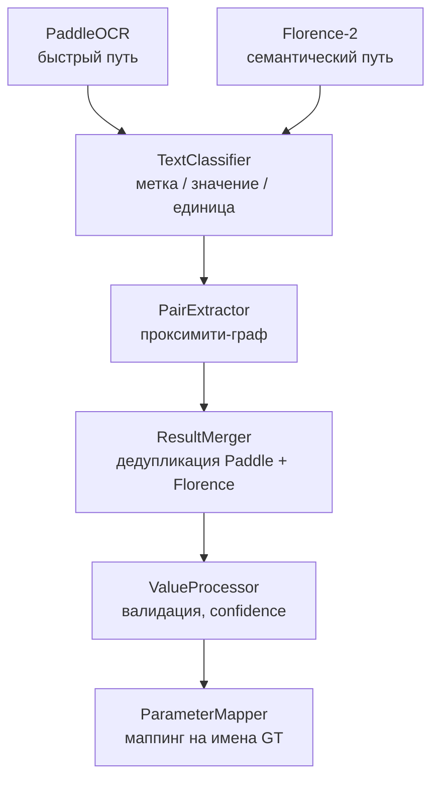
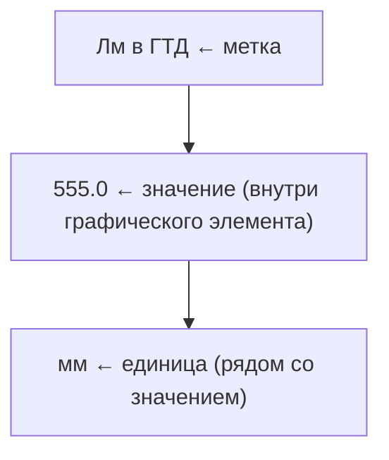

# Устаревший OCR-подход — Документация

> **Статус**: Устаревший (deprecated). Заменён на VLM-подход (Qwen3.5-4B).
> **Причина**: Точность ~15% без дообучения, задержка ~20 000 мс на кадр, невозможность надёжного связывания меток со значениями.

Данный документ описывает первоначальный подход к извлечению параметров SCADA на базе классического OCR-конвейера (PaddleOCR + Florence-2). Подход был полностью реализован, протестирован и **признан неработоспособным** для задачи извлечения данных из SCADA-мнемосхем.

---

## Содержание

- [Архитектура](#архитектура)
- [Компоненты конвейера](#компоненты-конвейера)
- [Почему подход провалился](#почему-подход-провалился)
- [Сравнение с VLM-подходом](#сравнение-с-vlm-подходом)
- [Уроки](#уроки)

---

## Архитектура



### Двухпутевая стратегия

OCR-конвейер использовал два параллельных движка распознавания:

1. **PaddleOCR (быстрый путь)** — запускается на каждом кадре, обеспечивает базовое распознавание текста с bounding boxes
2. **Florence-2-large (семантический путь)** — запускается по расписанию (каждые N кадров) или когда PaddleOCR показывает низкую уверенность

Результаты двух движков сливаются через `ResultMerger` с дедупликацией по IoU (Intersection over Union, порог 0.5).

---

## Компоненты конвейера

### `ocr_pipeline.py` — Главный оркестратор

Двухпутевой OCR-конвейер. Координирует все стадии обработки:

1. PaddleOCR fast-path (детекция + распознавание за один вызов)
2. Florence-2 semantic path (OCR_WITH_REGION, по расписанию)
3. Layout Analysis (TextClassifier → ProximityGraph → PairExtractor)
4. Fusion (ResultMerger — слияние результатов Paddle + Florence)
5. Confidence Scoring (Composite: OCR confidence + физическая валидация)

Оптимизации:
- Адаптивный пропуск Florence: если Paddle уверен (>0.9) последние 5 кадров — Florence не запускается
- Обнаружение смены сцены (SSIM > 0.97 → пропуск дублирующихся кадров)

### `florence_detector.py` — Florence-2-large

Мультитасковая модель Microsoft Florence-2-large (0.77B параметров):

| Задача | Токен | Результат |
|--------|-------|-----------|
| OCR (только текст) | `<OCR>` | Многострочный текст без координат |
| OCR с регионами | `<OCR_WITH_REGION>` | Текст + quad_boxes для каждого региона |
| Object Detection | `<OD>` | Bounding boxes + метки |
| Dense Region Caption | `<DENSE_REGION_CAPTION>` | Плотные описания регионов |

**Ограничения, выявленные при тестировании:**

| Проблема | Причина |
|----------|---------|
| `IndexError` на изображениях > 768px | Florence-2-large-ft: лимит positional embeddings ~2048 токенов |
| Нет нативных confidence scores | Florence-2-large-ft не поддерживает `compute_transition_scores` |
| Эвристический confidence | Формула: `0.70 + min(len*0.01, 0.15) - (1-diversity)*0.1` — ненадёжно |
| Задержка инференса ~8–12с на GPU | num_beams=3, max_new_tokens=1024 |

**Решение**: Использование `Florence-2-large` (pretrained, не ft) — поддерживает до 1536px и 4096 токенов. Но по-прежнему не решает проблему связывания меток со значениями.

### `ocr_engine.py` — Обёртка PaddleOCR

Интеграция с PaddleOCR 2.9+ через PaddleX:

- Режим: `ocr.predict(frame)` — детекция + распознавание за один вызов
- Поддержка формата `OCRResult` (PaddleOCR 2.9+) и legacy формата
- Ограничение размера кадра: MAX_OCR_DIM = 1280px

**Проблемы с кириллицей**:
- Русские аббревиатуры часто разбиваются на отдельные токены: «Лм» → «Л» + «м»
- Смешанные русско-английские метки («Рг после кр») распознаются с ошибками
- Числовые значения рядом с кириллическими метками часто теряются

### `text_classifier.py` — Классификация текстовых боксов

Классифицирует каждый распознанный текстовый бокс на:
- **LABEL** — название параметра (напр., «Температура масла»)
- **VALUE** — числовое значение (напр., «36.1»)
- **UNIT** — единица измерения (напр., «°C», «кПа»)

Классификация на основе эвристик:
- Регулярные выражения для чисел (с запятой/точкой, знаком минус)
- Словарь единиц измерения
- Позиционные признаки (значения обычно правее меток)

**Проблема**: На плотных SCADA-экранах метки и значения расположены не по стандартным паттернам — эвристики часто ошибаются.

### `pair_extractor.py` — Извлечение пар метка-значение

Связывает метки со значениями через **проксимити-граф**:

1. Строится граф соседства между всеми текстовыми боксами
2. Каждый LABEL связывается с ближайшим VALUE справа или снизу
3. UNIT привязывается к соответствующей паре

**Ключевая проблема**: На SCADA-мнемосхемах значения часто расположены:
- Внутри графических элементов (кружки, прямоугольники)
- На разных расстояниях от меток
- С перекрытиями между соседними параметрами
- В табличной форме без явных разделителей

Прокси-граф не может надёжно различать, к какой метке относится значение при плотном расположении элементов.

### `proximity_graph.py` — Прокси-граф

Реализация графа соседства для связывания текстовых боксов:
- Взвешенные рёбра по расстоянию между центрами боксов
- Приоритет горизонтальных связей (значения обычно правее меток)
- Порог максимального расстояния для исключения дальних связей

### `column_layout_analyzer.py` — Анализ колоночного макета

Попытка улучшить связывание путём анализа колоночной структуры:
- Определение вертикальных колонок меток и значений
- Кластеризация по X-координатам
- Связывание внутри колонок

Не решил проблему полностью из-за нерегулярного расположения элементов на мнемосхемах.

### `spatial_clusterer.py` — Пространственная кластеризация

Кластеризация текстовых боксов по пространственной близости:
- DBSCAN для группировки связанных элементов
- Определение логических групп (параметр + значение + единица)

### `result_merger.py` — Слияние результатов Paddle + Florence

Дедупликация результатов двух OCR-движков:
- IoU (Intersection over Union) для определения перекрывающихся боксов
- Порог IoU = 0.5 для слияния
- Приоритет Florence при конфликтах (выше семантическое качество)

### `value_processor.py` — Обработка значений

Обработка распознанных значений с многоуровневой валидацией:

1. **Очистка**: Удаление артефактов OCR (лишние символы, пробелы)
2. **Валидация диапазона**: Проверка физической допустимости (напр., температура -50..800°C)
3. **Валидация скорости**: Проверка реалистичности изменения между кадрами
4. **Валидация согласованности**: Сравнение с предыдущим значением
5. **Composite confidence**: `max(ocr_conf, validation_boost)` —boost до 0.90 при прохождении всех проверок

Формула composite confidence:
```
validation_boost = 0.0
+ range_valid:     +0.30  (значение в физически допустимом диапазоне)
+ rate_valid:      +0.20  (скорость изменения реалистична)
+ consistency:     +0.25  (согласовано с предыдущим значением)
+ detection_method: +0.15  (значение найдено рядом с меткой)
max_boost = 0.90
composite = max(ocr_confidence, validation_boost)
```

### `parameter_mapper.py` — Маппинг параметров

Связывание распознанных SCADA-аббревиатур с полными названиями параметров из отчёта (ground truth):
- Словарь маппинга: «Лм в ГТД» → «Уровень масла ГПД»
- Нечёткое сопоставление через SequenceMatcher
- Разрешение неоднозначностей по контексту (зона, тип параметра)

### `calibration.py` — Калибровка по шаблону

Попытка калибровки OCR по заранее известному шаблону SCADA-мнемосхемы:
- Известные позиции параметров на экране
- Привязка OCR-результатов к ожидаемым позициям
- Коррекция координат и значений

Не сработало из-за вариативности: разные версии SCADA, разные разрешения, переключение вкладок.

### `screen_detector.py` — Детекция экрана SCADA

Обнаружение и выделение области SCADA-мнемосхемы из кадра:
- Детекция границ мнемосхемы
- Компенсация тёмных рамок (Video 3 — ручная камера)
- Нормализация перспективы

### `color_filter.py` — Цветовая фильтрация

Использование цветовой семантики SCADA для фильтрации:
- Синий = активный параметр
- Красный = авария
- Зелёный = норма
- Серый = неактивный

Попытка использовать цвет для различения типов элементов. Не сработало из-за низкой специфичности — множество элементов одного цвета с разными функциями.

### `frame_preprocessor.py` — Предобработка кадров

Подготовка кадров для OCR:
- CLAHE (контрастное выравнивание гистограммы)
- Resize до MAX_OCR_DIM (1280px)
- Конвертация цветовых пространств

**Проблема с CLAHE**: Искажает цвета SCADA (синий → серый, красный → оранжевый). SCADA опирается на цветовую семантику, поэтому CLAHE был отключён.

### `confidence_scorer.py` — Оценка уверенности

Расчёт composite confidence для результатов OCR:
- Базовая уверенность от OCR-движка
- Бонус за физическую валидность
- Штраф за противоречия между движками

### `scada_pairer.py` — Специализированный спариватель SCADA

Попытка создания специализированного алгоритма связывания для SCADA:
- Использование знаний о типичном макете мнемосхем
- Приоритет определённых паттернов (метка слева, значение справа)
- Обработка табличных структур

Не дал существенного улучшения по сравнению с общим `pair_extractor`.

---

## Почему подход провалился

### 1. Фундаментальная проблема: связывание меток со значениями

OCR извлекает текст с координатами, но не понимает **семантические связи** между элементами. На SCADA-мнемосхеме:



OCR видит три независимых текстовых региона. Прокси-граф пытается их связать, но:
- 40+ параметров на экране → сотни возможных комбинаций
- Значения внутри графических элементов (кружки, рамки) — непредсказуемые расстояния
- Табличные данные без явных разделителей → неоднозначные связи

**Результат**: ~15% точности связывания на тестовых данных.

### 2. Проблема кириллицы

PaddleOCR хорошо работает на английском и китайском, но плохо на кириллических аббревиатурах:

| SCADA-метка | PaddleOCR результат | Florence-2 результат |
|-------------|-------------------|---------------------|
| Лм в ГТД | Лм в ГТД (иногда) | Лм в ГТД (обычно) |
| Рг после кр | Рг после кр (с ошибками) | Рг после кр (надёжно) |
| Т АВО | Т АВО (частично) | Т АВО (надёжно) |
| dP на решетке | dP на решетке (ок) | dP на решетке (ок) |

Florence-2 лучше с кириллицей, но не решает проблему связывания.

### 3. Ограничения Florence-2

| Проблема | Вариант модели | Причина |
|----------|---------------|---------|
| IndexError на изображениях > 768px | `large-ft` | Лимит positional embeddings ~2048 токенов |
| Нет нативных confidence scores | `large-ft` | `post_process_generation` не поддерживает `output_scores` |
| Задержка 8–12с на кадр | Оба варианта | num_beams=3, архаичная архитектура 0.77B |

### 4. Масштабирование калибровки

Калибровка по шаблону не работает:
- Разные версии SCADA-софта → разное расположение элементов
- Переключение вкладок → одни параметры исчезают, другие появляются
- Разные разрешения камер → координаты не совпадают
- Ручная камера (Video 3) → ракурс, тёмные рамки, блики

---

## Сравнение с VLM-подходом

| Критерий | OCR (PaddleOCR + Florence-2) | VLM (Qwen3.5-4B) |
|----------|------------------------------|-------------------|
| **Точность** | ~15% | **97.44%** |
| **Задержка на кадр** | ~20 000 мс | 6 000–18 000 мс |
| **Связывание метка-значение** | Ненадёжное (прокси-граф) | Нативное (модель понимает макет) |
| **Распознавание кириллицы** | Плохое (Paddle), хорошее (Florence) | Хорошее (мультиязычная модель) |
| **Адаптация на новую SCADA** | Переписывание правил, калибровка | Обновление промптов (~2–4ч) |
| **Дообучение** | Требуется (оценка: 500+ кадров) | Не требуется |
| **Понимание семантики** | Нет | Да (цвет, структура, контекст) |
| **Обнаружение вкладок** | Не реализовано | Через анализ остаточных областей |
| **Количество модулей** | 25+ файлов | 8 файлов |

---

## Уроки

1. **OCR — неверная абстракция для SCADA**. Проблема не в распознавании текста, а в семантическом понимании визуального макета. VLM решает обе задачи одновременно.

2. **Прокси-граф не работает на плотных экранах**. Когда 40+ параметров расположены на одной мнемосхеме, пространственная близость недостаточна для надёжного связывания.

3. **Цветовая семантика важна, но недостаточна**. SCADA использует цвет для индикации состояния, но не для идентификации элементов. Цветовые фильтры помогают, но не заменяют семантическое понимание.

4. **Калибровка по шаблону хрупка**. Любое изменение макета SCADA (обновление ПО, другая вкладка, другое разрешение) делает калибровку неработоспособной.

5. **VLM не нужен дообучения для SCADA**. Достаточно правильно составленного промпта с якорными таблицами и глоссарием аббревиатур. Это кардинально отличается от OCR, где каждый новый макет требует переобучения или перекалибровки.

6. **Зонная сегментация — ключ к успеху с малыми VLM**. Полный кадр 1912×1076 с 40+ параметрами перегружает 4B-модель. Кадрирование в фокусные зоны (5–15 параметров каждая) повышает точность с 7.84% до 97.44%.

7. **Композитный confidence не заменяет правильное извлечение**. Value processor с физической валидацией повышает уверенность, но не исправляет фундаментальную ошибку — неправильное связывание метки со значением.

---

## Сохранённые компоненты

Некоторые модули из устаревшего подхода были адаптированы для VLM-конвейера:

| Устаревший модуль | Что перенесено | Где используется сейчас |
|-------------------|---------------|----------------------|
| `zone_segmentor.py` | Логика сегментации + относительные координаты | `core/zone_segmentor.py` (переписан) |
| `video_ingestion.py` | Извлечение кадров из видео | `core/video_ingestion.py` (адаптирован) |
| `value_processor.py` → диапазоны | Физические диапазоны и типы параметров | `core/prompts.py` (встроены в промпты) |
| `ocr_models.py` | BBox, TextBox, TextPair | `core/` (частично используется в утилитах) |
